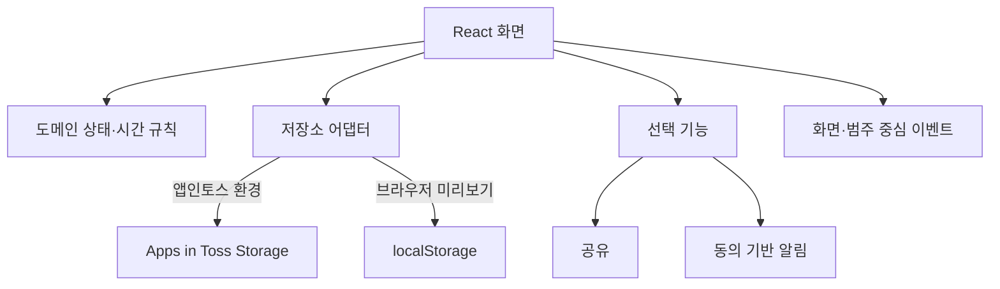

# Architecture Overview

## 사용자 흐름

화면 흐름은 온보딩, 항목 생성, 숙려, 재결정, 기록·리포트, 설정으로 나뉩니다. React 화면이 사용자의 동작을 연결하고, 도메인 규칙은 공통 함수로 분리해 상태와 시간 계산을 한 기준으로 처리합니다.

## 저장 경계

앱 코드에는 보류 기록을 별도 자체 서버 API로 동기화하는 흐름을 두지 않았습니다. 운영 환경에서는 앱인토스 Storage를 사용하고, 브라우저 미리보기에서는 localStorage로 대체합니다. 앱인토스 Storage의 처리 범위는 플랫폼 정책에 따릅니다. 읽기·쓰기 실패를 감싸 일반 웹 미리보기에서도 핵심 흐름을 확인할 수 있게 했습니다.

## 선택 기능과 개인정보

- 알림 요청에는 플랫폼에서 설정한 템플릿과 사용자의 동의가 필요합니다.
- 공유는 앱인토스 기능을 사용하고, 지원하지 않는 브라우저에는 기본 공유 기능 또는 클립보드 대체 동작을 둡니다.
- 이벤트에는 상품명, 자유 입력 이유, 외부 링크를 전달하지 않는 것을 기준으로 했습니다.
- 설정에서 저장된 기록을 지울 수 있습니다.

## 공개본과 운영본의 차이

이 문서는 구조를 설명하는 공개 요약본입니다. 운영 앱의 전체 소스나 콘솔 설정을 대체하지 않으며, 공개된 코드 조각만으로 앱을 빌드하거나 배포할 수 없습니다.
