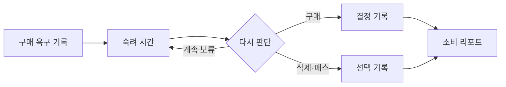

# 일단보류 · Hold First

**구매 직전, 잠깐 멈추고 다시 생각하도록 돕는 앱인토스 미니앱**

이 저장소는 운영 중인 개인 프로젝트를 소개하기 위한 포트폴리오 요약본입니다. 전체 운영 소스가 아니라 제품 흐름, 설계 결정, 공개 가능한 코드 일부만 담았습니다.

## 문제와 접근

구매를 무조건 막기보다 사용자가 사고 싶은 이유와 금액을 기록하고, 정한 시간 뒤 스스로 다시 판단할 수 있는 짧은 숙려 흐름을 만들었습니다.

## 프로젝트 정보

- 형태: 개인 기획·개발 프로젝트, 앱인토스 비게임 미니앱
- 담당: 사용자 흐름과 화면 설계, 프론트엔드 구현, 플랫폼 기능 연동
- 기술: React 18, TypeScript, Vite, Apps in Toss Web Framework, TDS Mobile
- 핵심 경험: 앱인토스 Storage 우선 저장과 브라우저 저장소 대체, 동의 기반 알림, 공유, 기록 삭제

## 주요 설계 결정

- **사용자 선택을 보조:** 구매를 차단하거나 금융 거래를 대신하지 않고, 기록·숙려·재결정 단계를 제공
- **플랫폼 차이 격리:** 저장소 어댑터가 앱인토스 Storage와 브라우저 localStorage의 차이를 감쌈
- **데이터 최소화:** 분석 이벤트에 상품명·구매 이유·외부 링크를 포함하지 않도록 구성
- **선택권과 복구:** 알림은 사용자 동의를 전제로 하고, 설정에서 기록 전체 삭제를 제공

## 공개 범위

여기에는 전체 앱 소스, 운영 콘솔 설정, 광고·알림 식별자, 실제 사용자 기록·대시보드 자료, 내부 기획 원문을 넣지 않았습니다. 코드 예시는 실제 구현에서 핵심 패턴만 발췌하고 서비스 식별값은 제외했습니다. 이 저장소만으로 사용자 성과나 사업 효과를 정량적으로 주장하지 않습니다.

아직 검토를 마친 앱 화면 캡처를 확보하지 못해 임의의 목업을 서비스 화면인 것처럼 넣지 않았습니다. 공개 전용 화면 캡처를 검토한 뒤 추가할 수 있습니다.

## 구성

- [`ARCHITECTURE.md`](ARCHITECTURE.md): 화면·도메인·저장 경계와 개인정보 고려사항
- [`CODE_EXCERPTS.md`](CODE_EXCERPTS.md): 공개 가능한 코드 발췌와 공개 범위
