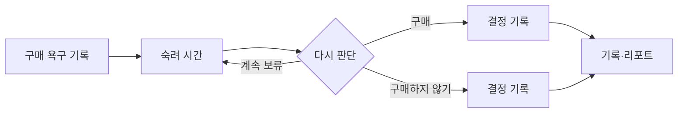

# 일단보류 | Hold First

> 사고 싶은 순간을 기록하고, 시간을 둔 뒤 스스로 다시 결정하는 앱인토스 미니앱

React와 TypeScript로 혼자 기획·개발해 앱인토스에 출시했습니다. 구매를 막거나 결제를 대신하지 않습니다. 사용자가 자신의 소비 이유를 남기고 **기록 → 숙려 → 재결정 → 돌아보기**를 한 흐름으로 경험하도록 만든 서비스입니다.

| 한눈에 보기 | 내용 |
| --- | --- |
| 역할 | 개인 프로젝트: 문제 정의, UX 설계, 프론트엔드 구현, 플랫폼 기능 연동 |
| 기술 | React 18, TypeScript, Vite, Apps in Toss Web Framework, TDS Mobile |
| 핵심 구현 | 보류 상태와 기한 계산, 저장소 어댑터, 동의 기반 알림, 기록·리포트 |
| 단계 | 앱인토스 출시·운영 |

## 어떤 문제를 풀었나

결제 직전에는 필요한 물건인지 차분히 판단하기 어렵습니다. 단순히 구매를 금지하는 대신, 사고 싶은 이유와 금액을 적어 두고 일정 시간이 지난 뒤 다시 판단하도록 했습니다. 사용자가 구매·계속 보류·구매하지 않기를 직접 선택하며, 지난 결정은 기록과 리포트에서 확인할 수 있습니다.

## 구현에서 신경 쓴 세 가지

| 문제 | 구현 | 사용자에게 주는 효과 |
| --- | --- | --- |
| 앱인토스 환경과 일반 브라우저의 저장 방식이 다름 | 저장소 접근을 한곳에 모아 앱인토스 Storage를 사용하고, 브라우저 미리보기에서는 `localStorage`로 대체 | 환경이 달라도 같은 보류 흐름을 확인할 수 있음 |
| 시간이 지나면 보류 상태가 달라져야 함 | `decisionDueAt`과 현재 시각을 비교해 `HOLDING`을 `DECISION_DUE`로 해석하는 도메인 함수를 분리 | 화면마다 기한 판단이 달라지는 일을 줄임 |
| 소비 기록은 사적인 정보임 | 상품명·구매 이유·외부 링크를 분석 이벤트에서 제외하고, 알림은 동의 후 요청하며, 전체 기록 삭제를 제공 | 기록과 알림에 대한 선택권을 사용자가 가짐 |

앱의 데이터 흐름과 선택 이유는 [설계 문서](ARCHITECTURE.md)에, 실제 구현에서 짧게 발췌한 부분은 [코드 예시](CODE_EXCERPTS.md)에 정리했습니다.

## 서비스 흐름에서 확인한 경계

- 보류 기한 전후에 화면의 상태와 남은 시간이 일관되게 표시되는가
- 앱인토스 기능을 사용할 수 없는 브라우저에서도 기록을 저장하고 다시 읽을 수 있는가
- 알림에 동의하지 않아도 핵심 기능을 계속 쓸 수 있는가
- 사용자가 기록을 삭제한 뒤 이전 항목이 다시 나타나지 않는가

이 프로젝트에서 배운 것은 화면을 만드는 일과 서비스가 끝까지 동작하게 하는 일이 함께 가야 한다는 점입니다. 플랫폼 차이, 시간에 따른 상태 변화, 사용자의 선택을 각각 코드의 경계로 분리했습니다.

## 공개 범위

이 저장소에는 제품 흐름과 설계 설명, 일부 코드 예시만 담았습니다. 전체 운영 소스와 콘솔 설정, 운영 식별자, 실제 사용자 기록은 포함하지 않습니다. 제시하지 않은 사용 지표나 성능 개선 수치를 성과로 주장하지 않습니다.
